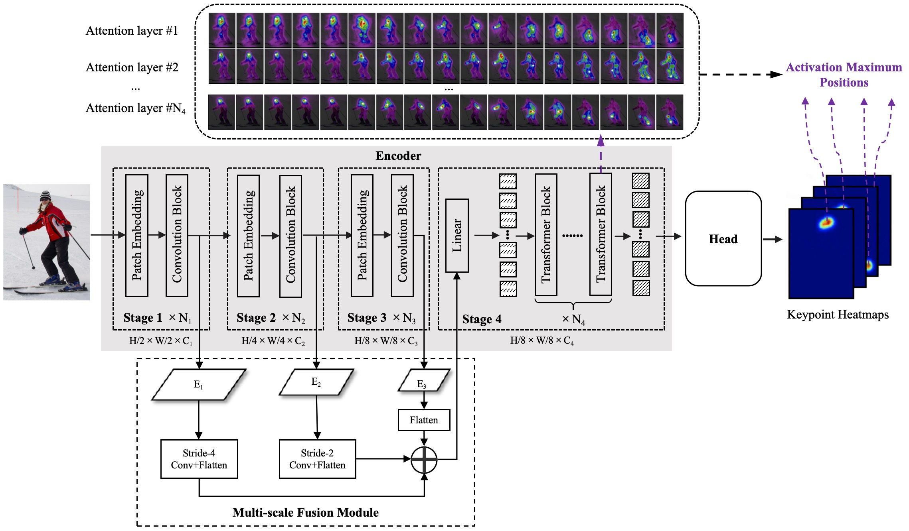
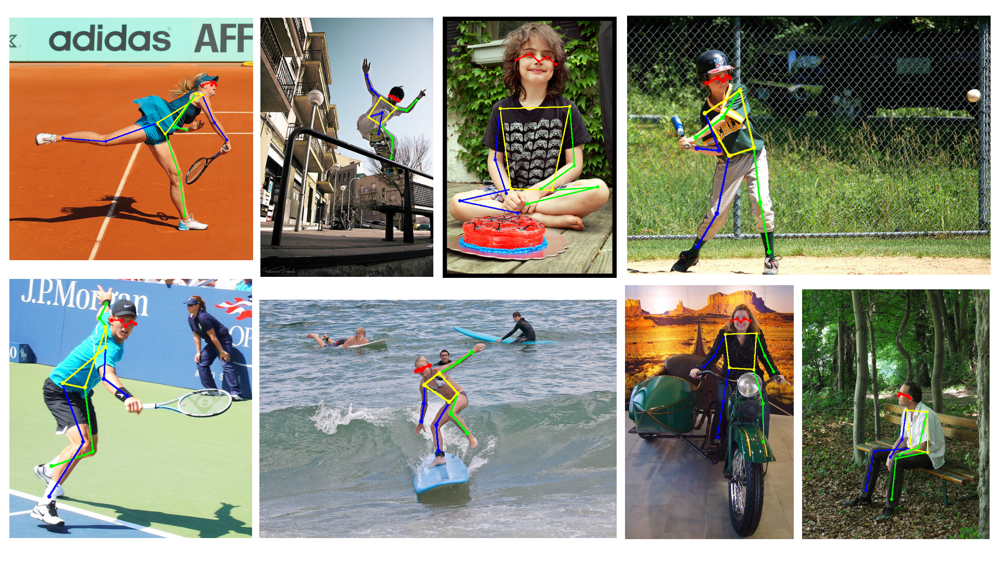
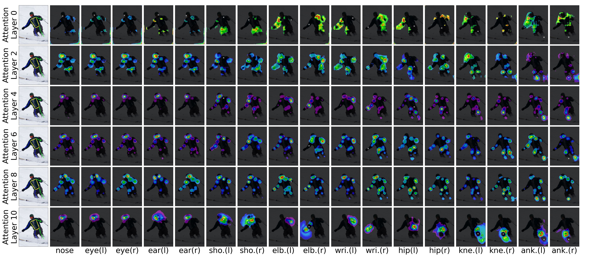
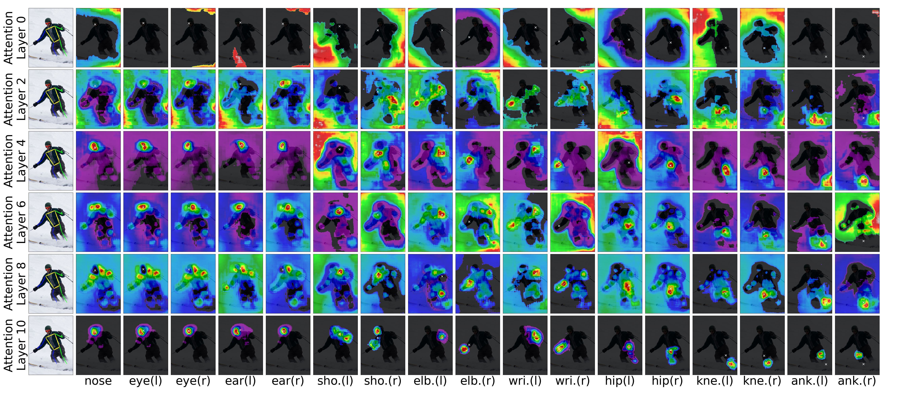

## Introduction
SSpose is a spatial-aware human pose estimation model based on the CNN-Transformer architecture.
* The model utilizes the final attention layer of the Transformer to aggregate attention scores from all image positions, thereby determining the optimal position in the heatmap for keypoint localization. This heatmap-based approach enables the model to explicitly capture spatial dependencies between specific keypoints and various image positions, thus providing enhanced interpretability.
* By introducing mask convolution and hierarchical masking strategy, MAE is integrated into SSpose, facilitating efficient self supervised training and improved model generalization.
* Compared to the state-of-the-art 2D human pose estimation models, SSpose models achieve competitive performance. On the COCO val set, it achieves an AP and AR of 77.3% and 82.1%, respectively, while on the COCO test-dev set, the AP and AR are 76.4% and 81.5%.

## Getting Started
### Prerequisites
* Linux
* Python 3.7+
* CUDA 10.2+
* GCC 5+

### Training and evaluation
* See [PRETRAIN.md](PRETRAIN.md) for pretraining.
* See [FINETUNE.md](FINETUNE.md) for pretrained model finetuning and linear probing. 

### Results on COCO val2017

|     Model      | Input size | Params | GFLOPs | AP    | Ap .5 | AP .75 | AP (M) | AP (L) |  AR   | 
| :------------: | :--------: | :----: | :----: | ----- | ----- | :----: | :----: | :----: | :---: | 
| SimpleBaseline |  256x192   | 68.6M  |  15.7  | 0.720 | 0.893 | 0.798  | 0.687  | 0.789  | 0.778 |
| HRNet          |  256x192   | 63.6M  |  14.6  | 0.751 | 0.906 | 0.822  | 0.715  | 0.818  | 0.804 | 
| DARK           |  256x192   | 28.5M  |  7.1   | 0.756 | 0.905 | 0.821  | 0.718  | 0.828  | 0.808 | 
| TokenPose      |  256x192   | 27.5M  |  11.0  | 0.758 | 0.903 | 0.825  | 0.723  | 0.827  | 0.809 | 
| TransPose      |  256x192   | 17.5M  |  21.8  | 0.758 | 0.901 | 0.821  | 0.719  | 0.828  | 0.808 | 
| HRFormer       |  256x192   | 43.2M  |  12.2  | 0.756 | 0.908 | 0.828  | 0.717  | 0.826  | 0.808 | 
| MTPose         |  256x192   | --     |  --    | 0.753 | 0.899 | 0.820  | 0.719  | 0.819  | 0.804 | 
| SSpose         |  256x192   | 49.5M  |  122.5 | 0.761 | 0.908 | 0.830  | 0.727  | 0.828  | 0.814 | 

### Results on COCO test-dev2017

|     Model      | Input size | Params | GFLOPs | AP    | Ap .5 | AP .75 | AP (M) | AP (L) |  AR   | 
| :------------: | :--------: | :----: | :----: | ----- | ----- | :----: | :----: | :----: | :---: | 
| TokenPose      |  256x192   | 27.5M  |  11.0  | 0.751 | 0.921 | 0.825  | 0.717  | 0.811  | 0.802 | 
| TransPose      |  256x192   | 17.5M  |  21.8  | 0.750 | 0.922 | 0.823  | 0.713  | 0.811  | --    | 
| MTPose         |  256x192   | --     |  --    | 0.744 | 0.920 | 0.821  | 0.712  | 0.802  | 0.796 | 
| SSpose         |  256x192   | 49.5M  |  122.5 | 0.755 | 0.924 | 0.827  | 0.721  | 0.815  | 0.808 | 

## Visualization

## Acknowledgement
The pretraining and finetuning of our project are based on [DeiT](https://github.com/facebookresearch/deit) and [MAE](https://github.com/facebookresearch/mae). Thanks for their wonderful work.

## License
SSpose is released under the [MIT License](https://github.com/yulinfangylf/SSpose/blob/main/LICENSE).

